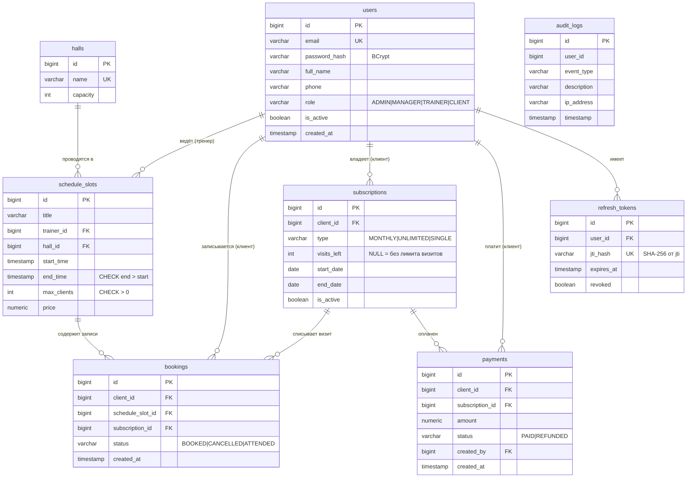

# ERD — схема базы данных

`audit_logs.user_id` намеренно без внешнего ключа: журнал должен пережить удаление пользователя.

Время занятий хранится как **местное время комплекса без часового пояса** (`TIMESTAMP`).
